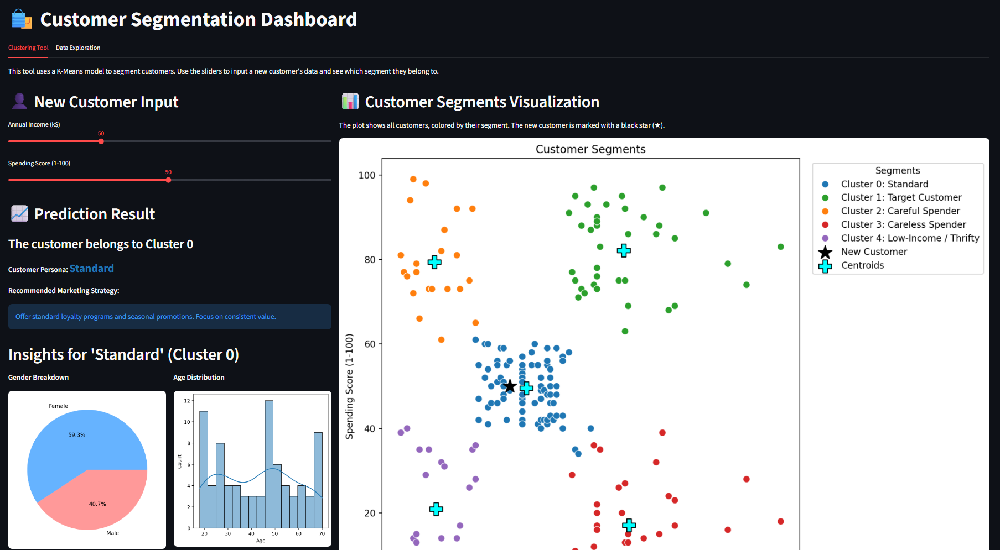
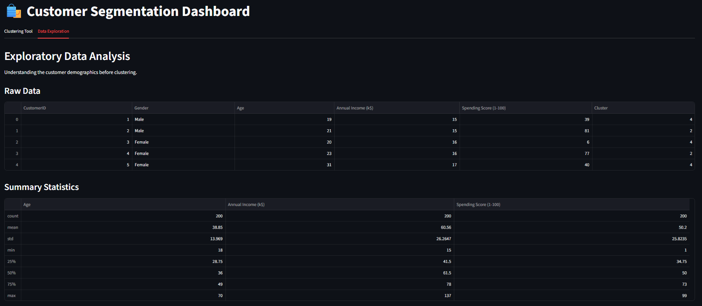
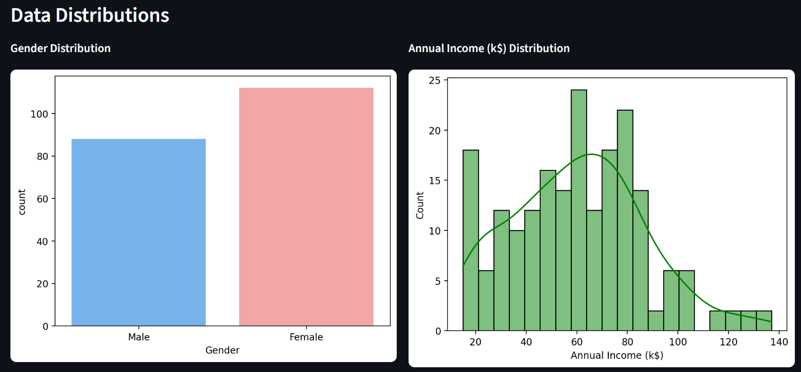
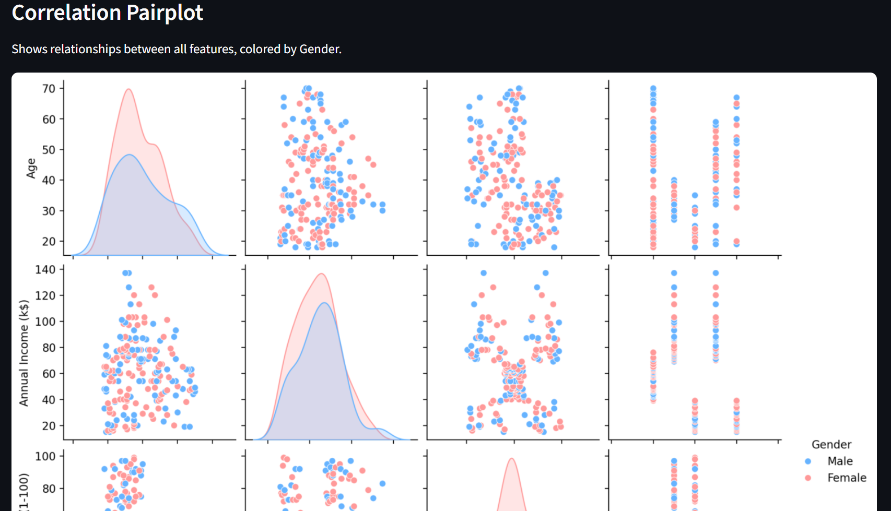
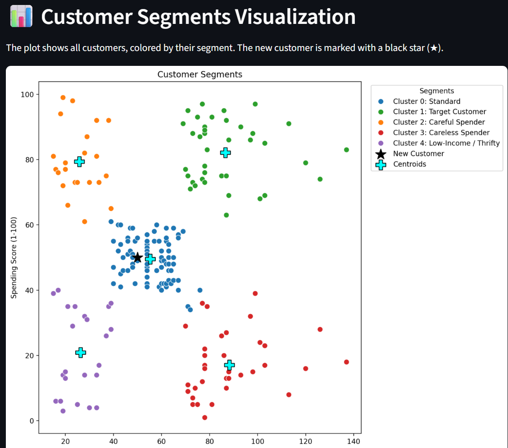
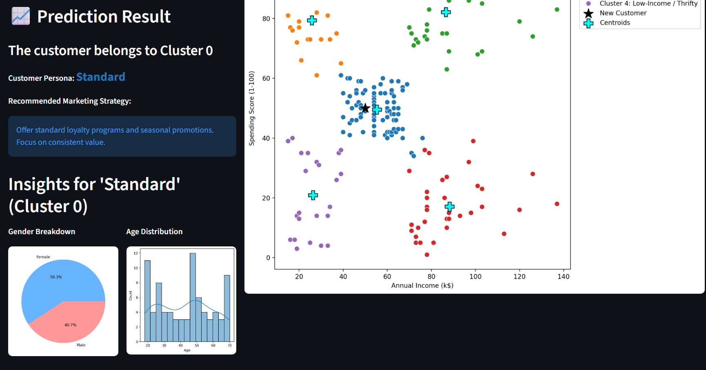

<div align="center">

# 🛍️ Customer Segmentation App

### Unlock the power of data-driven marketing with intelligent customer clustering

[](https://streamlit.io/)
[](https://www.python.org/)
[](https://scikit-learn.org/)

A powerful web-based dashboard built with Streamlit and Scikit-learn to perform K-Means clustering on [mall customer data](https://www.kaggle.com/datasets/vjchoudhary7/customer-segmentation-tutorial-in-python). This app allows you to explore existing customer segments and predict the segment for a new customer based on their income and spending score.

[Live Demo](#-live-demo) • [Features](#-features) • [Installation](#-how-to-run-locally) • [Tech Stack](#-tech-stack)

</div>

---

## 📸 Demo Screenshots

<div align="center">

### Main Dashboard

*Overview of the customer segmentation dashboard with interactive visualizations*

### Exploratory Data Analysis



*Interactive plots showing customer distribution and patterns*

### Cluster Visualization

*2D visualization of the 5 customer segments using K-Means clustering*

### Live Prediction

*Real-time customer segment prediction with persona analysis*

</div>


---

## ✨ Features

<table>
<tr>
<td width="50%">

### 📊 Exploratory Data Analysis
Interactive plots including histograms and scatter plots to deeply explore the customer dataset and uncover hidden patterns.

</td>
<td width="50%">

### 🎯 K-Means Clustering
Beautiful 2D visualization of 5 distinct customer segments, making it easy to understand your customer base.

</td>
</tr>
<tr>
<td width="50%">

### 🔮 Live Prediction
Intuitive sliders to input a new customer's Annual Income and Spending Score for instant segment prediction.

</td>
<td width="50%">

### 👥 Persona Analysis
Automatic cluster prediction with detailed persona descriptions (e.g., "Target Customer," "Careful Spender") and tailored marketing strategies.

</td>
</tr>
</table>

---

## 🚀 Live Demo

**[🌐 View Live Application](https://customer-segmentation-app-ge7b46vm9ye3if7pwbheya.streamlit.app/)**

Experience the app in action! Click the link above to try the customer segmentation tool without any installation.

---

## 🛠️ Tech Stack

<div align="center">

| Technology | Purpose |
|------------|---------|
|  | Core programming language |
|  | Interactive web application framework |
|  | Data manipulation and analysis |
|  | K-Means clustering and data scaling |
|  | Data visualization |
|  | Statistical data visualization |
|  | Model development and experimentation |

</div>

---

## 🏃 How to Run Locally

### Prerequisites
- Python 3.8 or higher
- pip package manager

### Installation Steps

1️⃣ **Clone the repository**
```bash
git clone https://github.com/Nikhil-Singh2745/customer-segmentation-app.git
cd customer-segmentation-app
```

2️⃣ **Create and activate a virtual environment**
```bash
# Create virtual environment
python -m venv venv

# Activate on macOS/Linux
source venv/bin/activate

# Activate on Windows
venv\Scripts\activate
```

3️⃣ **Install dependencies**
```bash
pip install -r requirements.txt
```

4️⃣ **Run the application**
```bash
streamlit run app.py
```

5️⃣ **Open your browser**

Navigate to `http://localhost:8501` to view the app.

---

## 📂 Project Structure

```
customer-segmentation-app/
│
├── app.py                  # Main Streamlit application
├── requirements.txt        # Python dependencies
├── Mall_Customers.csv      # Customer dataset
├── screenshots/            # Demo images for README
│   ├── dashboard.png
│   ├── eda.png
│   ├── clusters.png
│   └── prediction.png
└── README.md              # Project documentation
```

---

## 🎯 Use Cases

- 🏢 **Retail Marketing:** Identify high-value customers for targeted campaigns
- 💼 **Business Strategy:** Understand customer behavior patterns
- 📈 **Sales Optimization:** Tailor product offerings to specific segments
- 🎁 **Personalization:** Create customized shopping experiences
